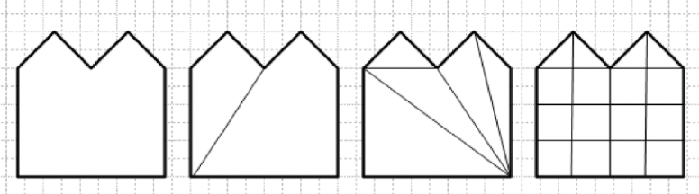
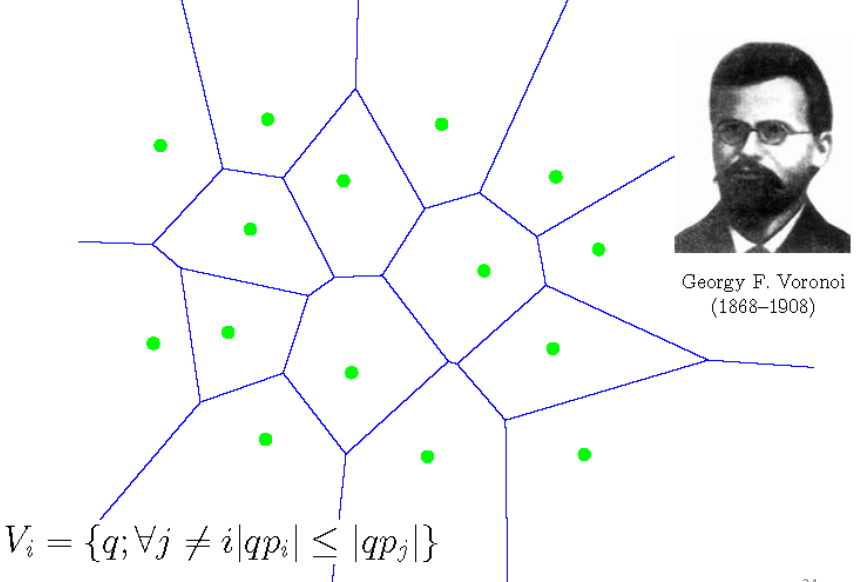
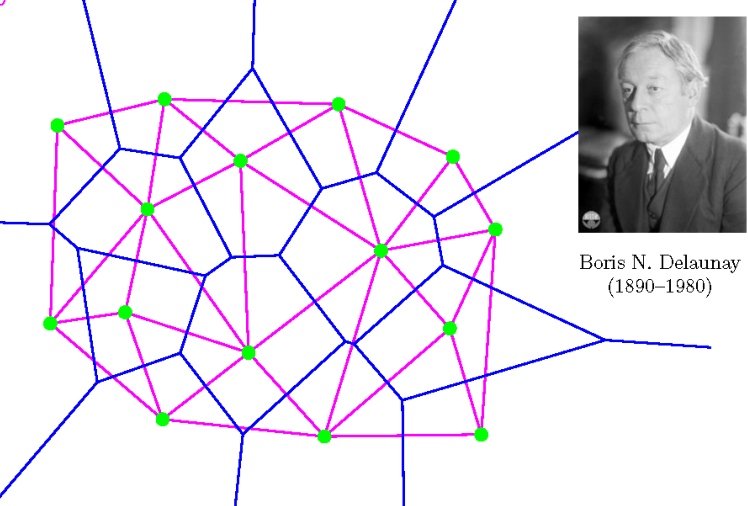
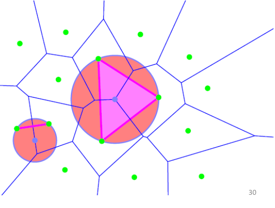
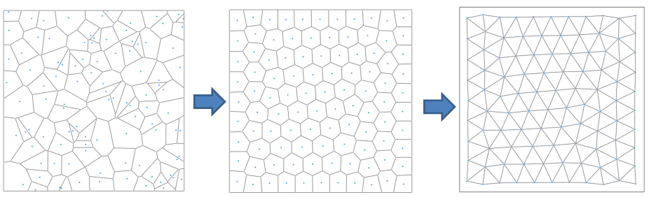

-
- 在三维建模中，一般使用平面多边形对三维曲面进行建模，特别是三角面片网格。
-
- ## 区域三角化
- **Tessellation 镶嵌**：将二维的多边形分割为其他容易处理的形状，例如凸多边形、三角形、四边形。特别地，如果分割为三角面片，则称该过程为**Triangulation 三角化**。
  {:height 179, :width 556}
- **如何表达三维物体**：使用点+线+面，三角网格。
- **OBJ 文件格式**：最基础情况记录 Vertices + Faces，还能记录其他额外属性。
-
- ### Voronoi 图与 Delaunay 三角化
- **Voronoi 图**：给定二维区域中的一些点，把平面分为多个部分，每个部分表示相比于其他点，离该点最近
  {:height 303, :width 393}
- **Delaunay 三角化**：在 Voronoi 图的基础上进行三角化
  {:height 302, :width 377}
-
- **DT 性质1**：每个三角面片的外接圆中没有其他点。如果一个圆过点集中的两个点，且圆中不包含第三个点，则连接这两个点的是 DT 中的一条边，称其为 **Delaunay Edge**.
  {:height 292, :width 357}
- **DT 性质2**： DT 最大化三角化中的最小角。
- **好的三角网格**：很难严格定义怎样的网格是好的，但是同意等边三角形和四面体是好的。
- **DT 不一定是好网格**：DT 只在给定点时优化连接性，但是往往选点对于网格的质量更加重要。
-
- ### 优化的 DT 算法
- **中心 Voronoi 图 CVT**：传统等距的 VT 往往得到的效果较差，CVT 使用一种迭代法，根据初始种子获得 Voronoi 图，然后计算每个区域的重心将种子点移到该位置，不断迭代（该算法称为 **Lloyd 算法**）
  
-
- ## 网格的存储
- **邻接矩阵**
-
-
- ## 参数化网格
- ### 参数化方法
- **参数化网格的问题**：给定三维三角网格点 $P_i \in \mathbb{R}^3, T_j = \Delta (P_{j_0}, P_{j_1}, P_{j_2})$，找到二维对应 $p_i \in \mathbb{R}^2, t_j = \Delta (p_{j_0}, p_{j_1}, p_{j_2})$，并尽可能减少扭曲。
- **投影参数化**：将网格点投影到一个平面上
- 
- **线性能量模型**：能更好地保持形状和局部的粗细
	- **Harmonic 能量**：可能会折叠
- **如何衡量失真**：定义一个扭曲函数 $f_j : T_j \rightarrow t_j$，最小化能量 $\sum _j E(f_j)$。该扭曲函数应该对正交变换不变，且尽量少压扁三角形。
-
- ### 应用
- **纹理映射**：将脸的图像贴到三维模型上。
- 其他略了
-
-
-