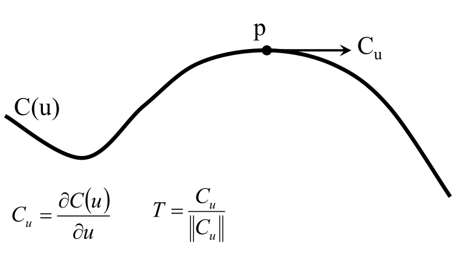
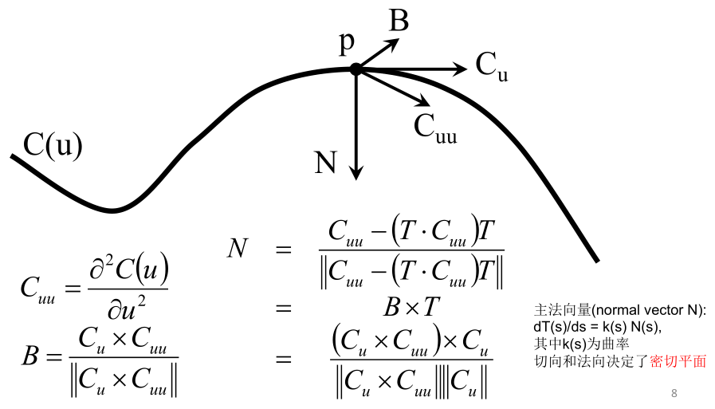
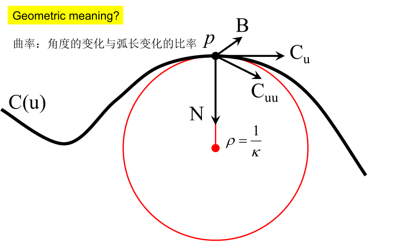
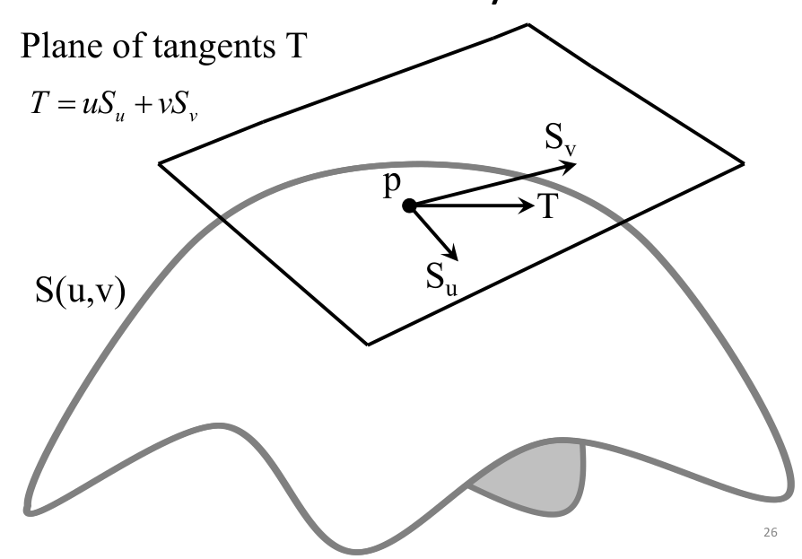

-
- ## 曲线微分几何
- 对于三维空间中的曲线 $C(u)$ 而言，定义 $C_u$ 为切向量，$T$ 为单位切向量
- 
- 进一步求导得到 $C_u$ 的导数 $C_{uu}$。垂直于 $C_u, C_{uu}$ 平面的单位向量为副法向量 $B$，$N$ 为主法向量指向曲率中心。
- 
- 曲率半径 $\rho$ 为相切圆的半径，曲率 $\kappa$ 是 $1/\rho$，曲率越大弯曲程度越大。
- 
- **曲率的计算**：对于 $C(t)$ 曲线而言，
- $$k(t)=\frac{x^{\prime}(t)y^{\prime\prime}(t)-y^{\prime}(t)x^{\prime\prime}(t)}{\left(x^{\prime}(t)^2+y^{\prime}(t)^2\right)^{3/2}}$$
-
- ## 曲面微分几何
-
- ### 第一、第二基本形式
- 给定曲面 $S(u, v)$，和点 $p(u_0, v_0)$，用 $S_u$ 和 $S_v$ 分别表示 $S(u, v)$ 关于 $u, v$ 的导数。可以构造切面 $T = uS_u, + v S_v$。
- {:height 330, :width 427}
- **第一基本形式**：给定曲面 $S(u, v)$，其第一基本形式为
  
  $$I = T \cdot T = \begin{bmatrix}u&v\end{bmatrix}I_S\begin{bmatrix}u\\v\end{bmatrix}$$
- **第二基本形式**：
-
- ### 坐标变换
-
-
-
-
-