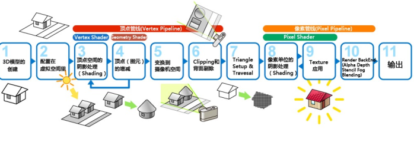

-
- ## 简介
- **渲染 Render**：渲染指的是从三维模型生成高质量二维图像的最终步骤，将三维场景中的所有细节（光照、材质、阴影、反射、折射等）都计算在内。
- **着色 Shade**：可以视为渲染的一个步骤，单独计算每个物体的颜色，提供实时的、基本的着色效果。其实现包括 OpenGL 和 Direct3D。
-
- ## 图形处理流水线
- **三维图形的要素**：对象（点、线、面等）、观察者、光源、材料属性
- **涉及模型**：成像模型、光照模型
- **图形系统处理流水线**：
- 
	- **顶点处理**：将世界坐标系转换为照相机坐标系，同时计算顶点颜色。
	- **裁剪器**：将不在视景体中的对象从场景中裁剪掉。
	- **光栅化**：为每个对象生成一个片段（一组潜在的像素），具有颜色和深度属性。
- **图形绘制管线**：应用程序阶段 -> 几何阶段 -> 光栅阶段。
- 
- **着色的流程**：
- {:height 282, :width 383}
-
- ## 光线追踪
- **光线追踪**：光线追踪即追踪场景中的所有光线，以获得全局的光照效果（包括反射、折射、吸收）等。然而由于光线追踪需要大量的计算量，一般采用反向跟踪方式。
- **反向跟踪**：只有到达视点的光线才有作用，因此从视点出发逆向跟踪光线。如果从视点出发的光线无法到达某个位置，则为阴影。
- **漫反射表面**：漫反射表明会生成无穷多的新光线，但在实际中只跟踪反射光和透射光。辐射度方法对漫反射表面的处理更加好。
- **光线追踪实现**：递归进行追踪
-
-
- ## 辐射度方法
- **辐射度方法**：模拟光线在封闭环境中的漫反射行为。
- **基本概念**：**能**表示光强度（必定守恒），**能通量**表示单位时间的能，**能密度**表示单位面积上的能通量。
- **基本原理**：能量守恒、表面离散化（物体表明被划分为许多小面片）、辐射度方程（描述了每个面片的自发光、反射光、接收的光）。
- **辐射度方程**：有三个式子，很复杂。
- **求解辐射度方程**：使用迭代法，Jocobi 迭代或者 Gauss-Seidel 迭代。
-
-
-