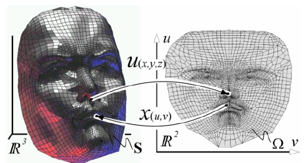

-
- ## 映射简介
- 比如要用一个球模拟橘子，可以把图片粘贴到球模型上（纹理映射），但是曲面太光滑就不令人满意，因此要进一步改变局部形状或者进行凹凸映射。
- **纹理映射**：用图像填充多边形。
- **环境/反射映射**：对于镜面反射环境光
- **凹凸映射 Bump Mapping**：在生成过程中通过改变法向量生成纹理。
- **位移映射 Displacement Mapping**：沿着法向量方向移动顶点位置。
- 
- **映射在流水线中的位置**：在输出流水线的最后
- 
-
- ## 纹理映射的原理
- **纹理映射框架**：即将参数坐标映射到世界坐标中的模型表面上
- 
- **参数化曲面**：本质上就是要参数化曲面，将三维模型表面放置到二维
- 
-
-
- ## 其他类型的纹理映射
- ### 环境映射
- **起因**：高度反射表面会反射周围环境，一种方式是用光线追踪，但也可以用环境映射
- **方式**：对于每个多边形，将照相机放在多边形中心，朝向外侧，然后将获得的图像贴在模型上。
- **问题**：由于拍摄时场景里没有该模型图像不是很正确，而且移动镜子时需要多次投影。
- ### 凹凸映射
- **起因**：橘子表面的凹凸不是颜色的差别，而是形状问题
- **基本想法**：沿着曲面法向进行随机扰动
- ### 位移映射
- 沿着法向量方向移动顶点位置。
-