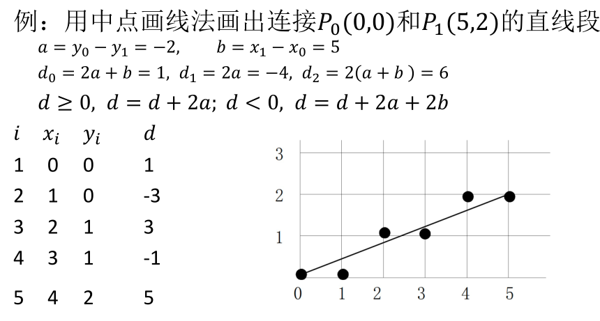

-
- ## 简介
- **光栅化/扫描转换**：将图形离散化为图像。
- **反走样**：光滑图像。
-
- ## 直线的光栅化
- ### 数值微分法 DDA
- 给定 $(x_{1}, y_{1}), (x_{2}, y_{2})$，计算 $m = \frac{y_{2} - y_{1}}{x_{2} - x_{1}}$，在 $|m| \leq 1$ 情况下 $x$ 每前进一步，$y$ 取 $\mathrm{int}(y + 0.5)$。
  id:: 676bbcef-11e5-4fcc-8637-81eaa97b5a98
- {:height 284, :width 489}
-
- ### 中点画线法
- 给定 $(x_{1}, y_{1}), (x_{2}, y_{2})$，表达直线为 $ax + by + c = 0$，其中 
  
  $$a = y_{1} - y_{2}, b = x_{2} - x_{1}, c = x_{1}y_{2} - x_{2}y_{1},$$
  
  设当前像素点为 $(x_{p}, y_{p})$，判断与  $x_{p}+1$ 的交点在 $y_{p} + 0.5$ 的上方或者下方。使用判别式 $d = a(x_{p} + 1) + b(y_{p} + 0.5) + c$，若 $d < 0$ 则取右上，$d > 0$ 则取右方。
- 为了避免小数运算，取 $d^\prime = 2d$，这样只需要整数运算。
- {:height 288, :width 493}
-
- ### Bresenham 算法
- 对 DDA 进行改进，设 $d$ 为图示值，则 $d>0.5$ 取上方，否则取下方。取 $e = d - 0.5$，此时 $e > 0$ 取上方，否则取下方。每步 $e$ 增加 $k$，如果为正，则需要扣去 $1$。
- {:height 178, :width 525}
- 
-
- ## 圆的光栅化
- ### 中点法
-
- ### Bresenham 算法
-
- ### 正负判定法
-
- ## 一般曲线的光栅化
- 理解为一列直线
- {:height 343, :width 449}
-
- ## 多边形的光栅化
- ### 奇偶检测法
-
- ### 环绕数测试
-
- ### 扫描线算法
-
- ### 边界标志法
-
- ### 区域填充法
-
- ## 反走样
-
-
-