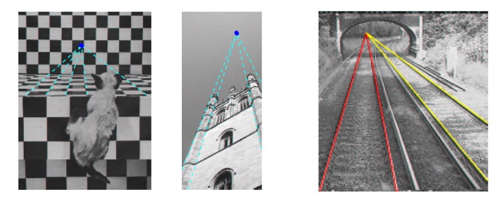
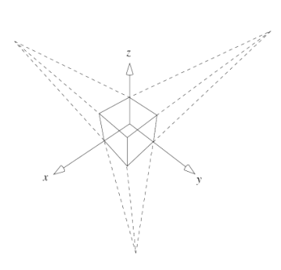
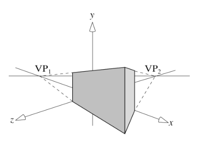
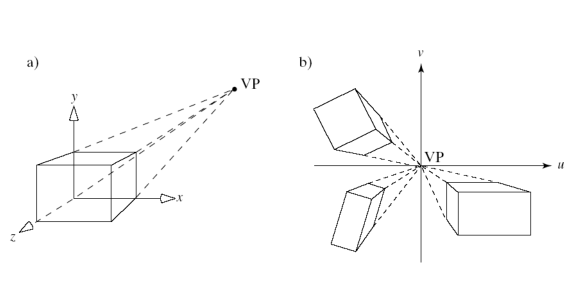
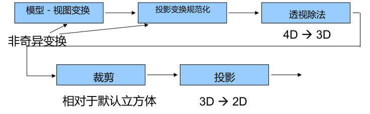

-
- ## 经典视图
- **经典视图**：即日常生活中观察物体的方式，选取一个对象和方向进行观察，包括透视图、正交图等。
	- 三要素：对象、观察者与投影面、投影变换
- **平面几何投影**：将对象投影到平面，投影线聚焦或者相互平行。保持共线性但是不一定保角。
	- **平行/正交投影**：投影线相互平行。
	- **透视投影**：投影线聚焦于一点。
- **基准面 Principal faces**：三个正交的方向。
-
- ### 平行/正交投影
- **轴测投影**：
-
- ### 透视投影
- **灭点**：对象上所有平行线投影后交于一点。
  
- **三点透视**：没有基准面平行于投影面，立方体投影中有三个灭点。
  {:height 342, :width 315}
- **两点透视**：一个基准方向平行于投影面，立方体投影有两个灭点。
  {:height 331, :width 419}
- **单点透视**：一个基准面平行于投影平面，立方体投影中有一个灭点。
  {:height 283, :width 557}
- **优势**：看起来更真实。
- **缺点**：不等距、不保角、难手工绘制。
-
- ## 计算机视图
- **计算机视图**：在计算机图形学中，使用数学和算法来生成三维场景。
	- 定位照相机/设置模型-视图矩阵：调整相机的位置和方向。
	- 设置镜头/投影矩阵：定义了如何将三维场景投影到二维平面上。
	- 裁剪/设置视景体：调整可见区域范围。
- 
-
- ### 透视除法
- **透视除法**：将四维齐次坐标转换为三维坐标。
-
- ### 视景体
-
-
- ### 投影矩阵
-
-
-