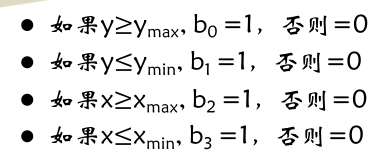
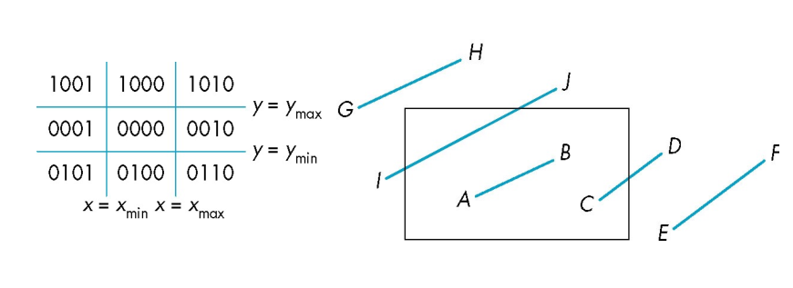
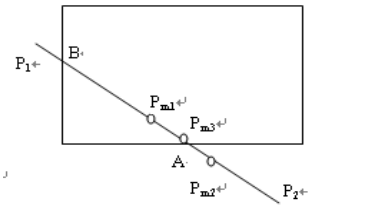
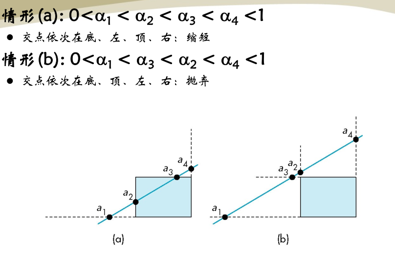
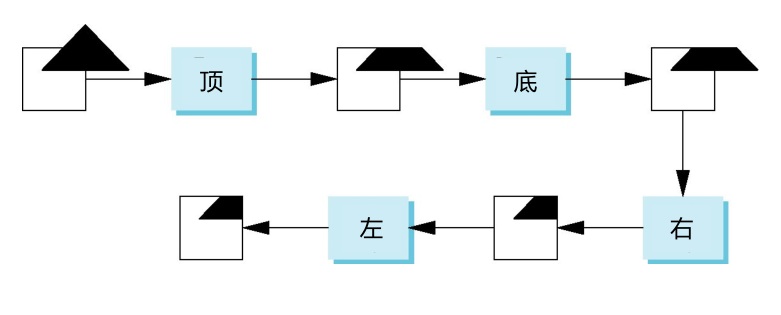
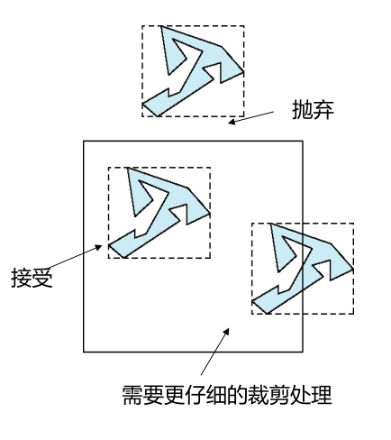
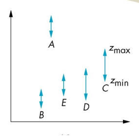
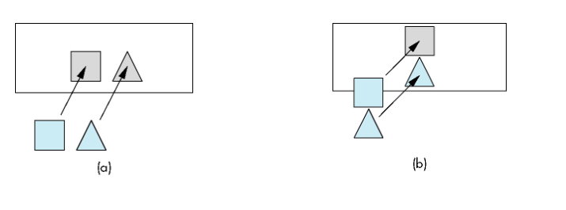
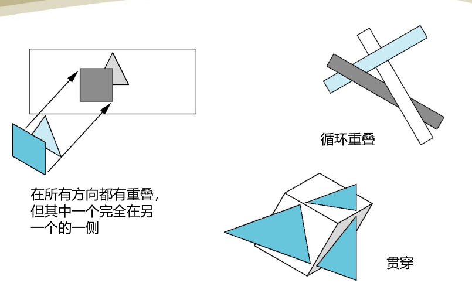

-
- ## 绘制流程
- **绘制流程**：建模 -> 几何处理 -> 光栅化 -> 显示
- **几何处理**：从世界坐标系转换为照相机坐标，创建标准视景体，裁剪掉不在视景体中的对象，消除隐藏面，明暗处理，最终得到二维图像。
-
- ## 线段的裁剪
- **直观想法**：直接将线段与窗口求交
- **Cohen-Sutherland 算法**：尽可能不求交就排除许多情况，对于每个端点 $(x, y)$，定义编码 $b_0b_1b_2b_3$，其中 $x_{\min}$ 等是窗口坐标。该编码将空间分为九个区域。
- {:height 159, :width 323}
- **例**：$AB$ 编码为 `0000`，则直接可接受；$C$ 为 `0000`，$D$ 为 `0010`，此时根据 $1$ 在第三位可知要与 $x = x_{\max}$ 做求交；$E, F$ 均为 `0010`，两者按位与发现仍然有 `1`，因此直接抛弃；$GH$ 和 $IJ$ 分别的编码相同，按位与发现无 `1`，因此只能做求交。
- {:height 214, :width 537}
-
- **中点法**：首先基于 Cohen-Sutherland 编码，排除两个端点编码均为 `0000` 以及按位与有 `1` 的线段。如果两个点都在外面但是按位与无 `1`，则做二分法尝试找到交点
- {:height 222, :width 345}
-
- **Liang-Barsky 裁剪算法**：参数化表示线段 $p(\alpha) = (1 - \alpha) p_1 + \alpha p_2, 0 \leq \alpha \leq 1$，求出相交的 $\alpha$ 值。且按照顺序进行排序底面 $\alpha_1$，左侧 $\alpha_2$，顶边 $\alpha_3$，右边 $\alpha_4$。
- {:height 340, :width 549}
-
- ## 多边形的裁剪
- **多边形裁剪流水线**：
- {:height 232, :width 551}
- **包围盒**：先用一个立方体把多边形框起来，可以便捷地判断多边形的接受与抛弃。
- {:height 379, :width 279}
-
- ## 隐藏面消除
- **简单思路**：两两考虑对象，互相检测位置，但是复杂度要 $O(n^2)$。
- **画家算法**：比如 B 在 A 后面，则先画 B 再画 A，这样 A 就把 B 覆盖了。
- **画家算法-深度排序**：
- 情况一、A 在其他所有多边形后面，则直接画出来。
- {:height 311, :width 272}
- 情况二、多边形如果在 XY 方向没有重叠，也可以直接画出来。
- {:height 221, :width 571}
- 剩余复杂情况需要单独处理：可以通过对每个像素进行追踪
- {:height 367, :width 517}
- **Z 缓冲区算法**：存储目前为止每个像素对应最近对象的深度，在新增对象时更新。
-
-
-
-
-
-
-
-
-
-
-