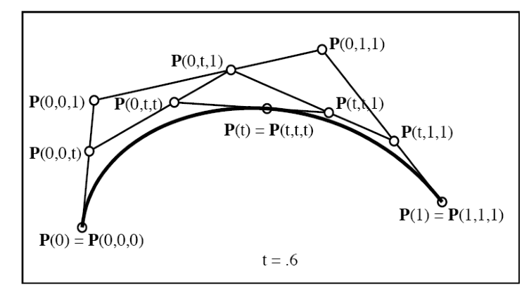
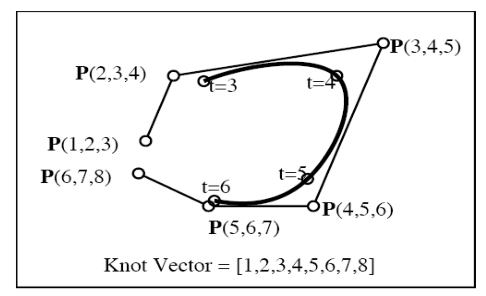
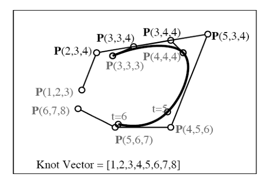
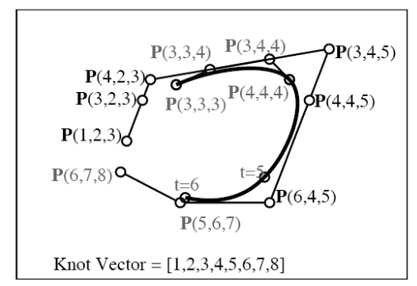
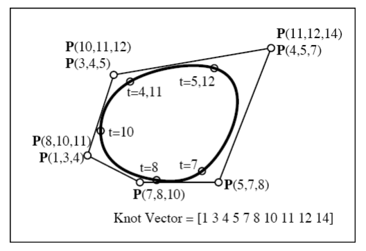
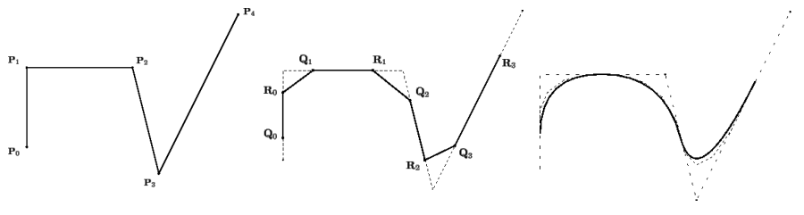

-
- ## 贝塞尔曲线
- **定义(贝塞尔曲线)**：贝塞尔曲线是由 $n$ 个控制点控制的 $n-1$ 次多项式曲线。例如给定控制点 $P_{0}, P_{1}, P_{2}, P_{3}$，可以构造三次贝塞尔曲线
  
  $$ B(t) = (1 - t)^{3} P_{0} + 3 (1 - t)^{2} t P_{1} + 3(1 - t) t^{2} P_{2} + P_{3}.$$
- 为了方便后续对贝塞尔曲线的分割，我们对控制点进行标号。我们设参数化贝塞尔曲线的起始点和终止点的参数值分别为 $a, b$，例如弧长比例参数 $a = 0, b = 1$。
- **定义(控制点标号)**：对于一个 $n$ 阶（$n-1$ 次）贝塞尔曲线 $P(t)$ 而言，需要 $n$ 个控制点。我们为控制点设置 $n$ 个标号，即标号为 $P_{i} = P(u_{1}, u_{2}, \cdots, u_{n})$，起始 $u_1 = u_2 = \cdots = u_n = a$，后续一个个变为 $b$。
- **定义(对称性)**：定义上述 Polar values 都有对称性。
- 例如三次贝塞尔曲线的控制点标号为
  
  $$ P_{0} = P(a, a, a), \quad P_{1} = P(a, a, b), \quad P_{2} = P(a, b, b), \quad P_{3} = P(b, b, b)$$
- **定义(仿射组合/线性性)**：给定 $P(u_{1}, u_{2}, \cdots, u_{n-1}, a)$ 和$P(u_{1}, u_{2}, \cdots, u_{n-1}, b)$，定义
  id:: 6767aacf-388f-4969-b392-84afd357f9c6
  
  $$ P(u_1,u_2,\cdots,u_{n-1},c)=\frac{(b-c)P(u_1,u_2,\cdots,u_{n-1},a)+(c-a)P(u_1,u_2,\cdots,u_{n-1},b)}{b-a} $$
  
  将 $P(u_1, u_2, \cdots, u_{n-1}, c)$ 称为后两者的*仿射组合*。
- **例**：例如有以下例子
  
  $$P(0,t,1)=(1-t)\times P(0,0,1)+t\times P(0,1,1),$$
  
  $$P(0,t)=\frac{(4-t)\times P(0,2)+(t-2)\times P(0,4)}{2}.$$
- **定理**：通过上述的仿射组合和对称性，贝塞尔曲线上任一点 $P(t)$ 可被表示为
  
  $$P(t) = P(t, t, t, \cdots, t).$$
- 例如 $3$ 阶贝塞尔曲线可以如下获得 $P(t)$：
  
  {:height 281, :width 485}
-
-
- ## B-样条曲线
-
- ### B 样条定义
- **B-样条基函数**：$N_{i,1}(t)$ 定义为在 $[t_{i}, t_{i+1})$ 为 $1$，其余位置为 $0$ 的函数。递归关系满足
  $$ N_{i,k}(t) = \left( \frac{t - t_{i}}{t_{i+k-1} - t_{i}}  \right) N_{i, k-1}(t) + \left( \frac{t_{i+k} - t}{t_{i+k} - t_{i+1}} \right) N_{i+1, k-1}(t) . $$
- **B-样条曲线**：B-样条曲线 $P(t)$ 定义为
  id:: 6766a95d-ad94-49fe-81a5-433f6f6af168
  $$P(t) = \sum_{i=0}^{n} P_{i} N_{i, k}(t). $$
  其中 $P_{i}, i = 0, \cdots, n$ 是 $n+1$ 个控制点，$N_{i,k}(t)$ 是基函数。$k$ 是阶数，表示其基函数为 $k$ 段的 $k - 1$ 阶多项式。
-
-
- ### B 样条与贝塞尔曲线
- **Knot Vector**：B 样条的插值节点对应的参数值。
- **B-样条与Bezier曲线**：B 样条可以理解为一列 $n$ 阶 $C^{n-1}$ 阶光滑的 Bezier 曲线。以下图为例，由于 $P$ 含有三个参数，其是三阶二次多项式样条。其总共要在 $8$ 个位置进行插值，
- {:height 309, :width 495}
- **从B样条中获得Bezier曲线**：以 $[3,4]$ 参数段为例，插值点的值为 $P(3,3,3)$ 和 $P(4,4,4)$，$[3,4]$ 贝塞尔曲线还有控制点 $P(3,3,4), P(3,4,4)$。
- {:height 346, :width 451}
- {:height 362, :width 463}
- **例(周期样条)**：
- {:height 368, :width 496}
-
- ### 节点插入
-
-
-
- ## 样条曲面
-
- ### 张量积曲面
-
- **NURBS 曲面**：
-
- ### T 样条
- T 样条可以实现在二维非均匀网格上进行插值，获得样条曲面
-
- ### 局部加密
- 分为四步：
	- 往 T 网格中插入所有期望的控制点
-
- ## 细分
- 输入一个多边形，输出不断细分后的一个光滑曲线。
- 
-
-