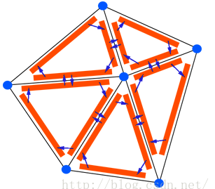

-
- 半边 (Half-Edge) 数据结构是一种高效的多边形网格表示结构，其不存储完整的边信息，取而代之的为半边的信息。能够高效地处理网格细分、合并、切割，其可以在常数时间内完成查询操作。
- {:height 294, :width 275}
-
-
- ## 数据结构
- Mesh 在半边数据结构下往往表示为**半边**、**顶点**、**面**三种数据结构。
- ### 半边 Half Edge
- 半边指的是全边的半侧有向边，其数据结构要求包含：
	- **起始顶点**
	- **下一条半边 Next Half Edge**：指的是围成同个多边形面片的下一条半边
	- **对偶半边**
	- **所属面**
- ### 顶点 Vertex
- 顶点是 Mesh 中的节点，数据结构包括：
	- **位置**
	- **其中一条出发半边**
- ### 面 Face
- 面指的是 Mesh 中一个多边形面片，数据包括：
	- **其中一条半边**
- ### 网格 Mesh
- 网格记录上述所有**半边**、**顶点**、**面**即可。
- ## 查询操作
- **寻找两个顶点之间的半边**：从一个顶点出发，判断其出边的终点（通过对偶边的起点），如果不是目标，则取对偶（变成进边了），再取下一条（变成出边）。如此循环。
-