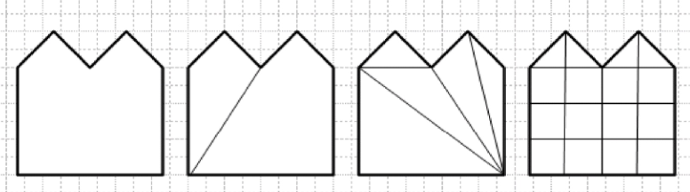
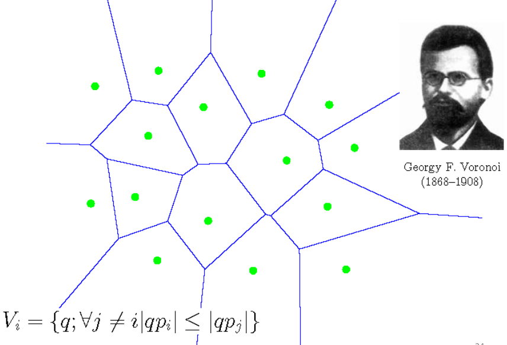
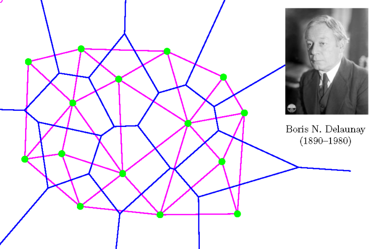
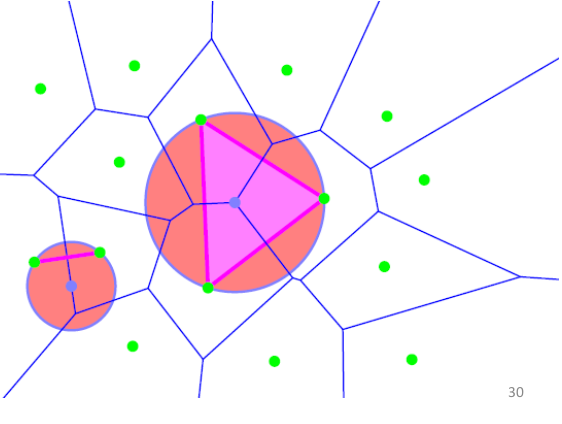
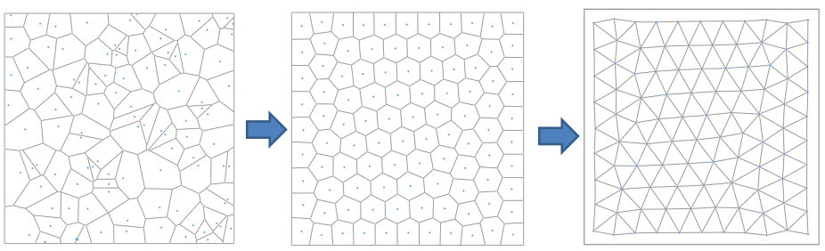

-
- 在三维建模中，一般使用平面多边形对三维曲面进行建模，特别是三角面片网格。
-
- ## Introduction
  id:: 673de77b-d889-462b-944c-302b26ebac0d
- **三维数据的来源**：
- **Tessellation 镶嵌**：将二维的多边形分割为其他容易处理的形状，例如凸多边形、三角形、四边形。特别地，如果分割为三角面片，则称该过程为**Triangulation 三角化**。
  {:height 179, :width 556}
- **如何表达三维物体**：使用点+线+面，三角网格。
- **OBJ 文件格式**：最基础情况记录 Vertices + Faces，还能记录其他额外属性。
-
- ## Voronoi 图与 Delaunay 三角化
- **Voronoi 图**：给定二维区域中的一些点，把平面分为多个部分，每个部分表示相比于其他点，离该点最近
  {:height 303, :width 393}
- **Delaunay 三角化**：在 Voronoi 图的基础上进行三角化
  {:height 302, :width 377}
-
- **DT 性质1**：每个三角面片的外接圆中没有其他点。如果一个圆过点集中的两个点，且圆中不包含第三个点，则连接这两个点的是 DT 中的一条边，称其为 **Delaunay Edge**.
  {:height 292, :width 357}
- **DT 性质2**： DT 最大化三角化中的最小角。
- **DT 的缺陷**：DT 只在给定点时优化连接性，但是往往选点对于网格的质量更加重要。
-
- ## 优化的三角化算法
- **中心 Voronoi 图 CVT**：传统等距的 VT 往往得到的效果较差，CVT 使用一种迭代法，根据初始种子获得 Voronoi 图，然后计算每个区域的重心将种子点移到该位置，不断迭代（该算法称为 **Lloyd 算法**）
  
-
-
-
-
-
-
-
-