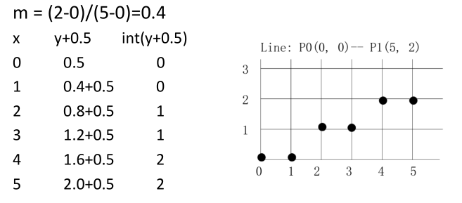
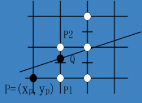

-
- 光栅化（扫描转换）研究如何将图形转换为图像，例如直线、圆、曲线等。
-
- ## 直线的光栅化
- ### 数值微分法（DDA）
- **思想**：考虑直线 $y = mx + h$，其满足
  
  $$y^\prime = m = \frac{y_2 - y_1}{x_2 - x_1},$$
  
  因此 $x$ 每增加一个格子，$y$ 增加 $m$，并取整数即可。
- **算法**：
  ``` cpp
  for(x = x1; x <= x2; ++x){
    y += m;
    write_pixel(x, round(y));
  }
  ```
  注意：上述算法适用于 $|m| \leq 1$ 的情形，如果 $|m|>1$ 则互换 $x, y$。
- **例**. 用 DDA 算法扫描连接 $P_0(0, 0)$ 和 $P_1(5, 2)$ 的直线。注意下面算例并非描像素而是描点，y+0.5的目的是使得向下取整可以获得最近的点坐标，当然也可以不加 0.5 直接找最近的整数，但这样就麻烦。
  {:height 294, :width 521}
-
- ### 中点画线法
- **思想**：当前像素点 $(x_p, y_p)$ 已被描，设 $M = (x_p + 1, y_p + 0.5)$，将理想直线与 $x = x_p + 1$ 相交于 $Q$，若 $Q$ 在 $M$ 上方则 $Q$ 上方格点为下一个被描点，否则为 $Q$ 下方格点。
  {:height 192, :width 230}
- **算法**：设直线过 $(x_0, y_0)$ 和 $(x_1, y_1)$，则直线可以表示为
  
  $$ F(x,y) = (y_0 - y_1) x + (x_1 - x_0) y + x_0y_1 - x_1y_0 = 0 $$
  
  构造判别式 $d = F(M) = F(x_p + 1, y_p + 0.5)$，若 $d < 0$ 则取上方，$d > 0$ 取下方，$d = 0$ 则均可。由于 $d = F(M)$ 是线性函数，可使用增量计算加速。
- **增量计算加速**：
- id:: 673b29a3-4bf9-43da-b17c-844b53a5900b
-
-
-
-