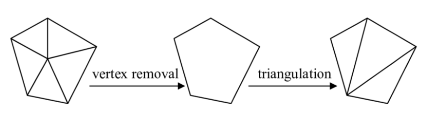
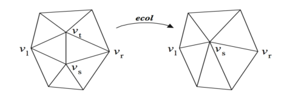

-
- ## Introduction
- **Mesh 网格简化**：使用更少节点组成的 Mesh 去表示模型，但是保证几何特征。
	- 原因：减少模型大小，提高运行效率
- **三种简化类型**：
	- **静态简化**：模型加载和使用前的一次性简化。
	- **动态简化**：在应用运行时根据需要实时调整
	- **视点相关简化**：根据观察者视角进行调整
-
- ## 顶点去除 Vertex Decimation
- 计算误差平面：对于每个顶点 $v$，考虑其所有三角面片，假设第 $k$ 个三角面片有单位法向量 $\mathbf{n}_k$，质心 $x_k$ （即三个顶点和平均），面积 $A_k$，则使用以下公式计算加权法向量和加权质心：
  
  $$\mathbf{n} = \frac{\sum_k A_k \mathbf{n}_k}{\sum_k A_k}, \hat{\mathbf{n}} = \frac{\mathbf{n}}{\|\mathbf{n}\|}, x = \frac{\sum_k A_k x_k}{\sum_k A_k} $$
  
  则可以根据单位法向量 $\hat{\mathbf{n}}$ 和一点 $x$ 计算出一个平面。
- 计算误差：将每个顶点 $v$ 到误差平面的距离视为误差度量，选择到误差平面最小的顶点并删除，并重新对该部分的顶点进行三角化。
  id:: 6741afec-224f-40db-9e59-321edcc0b468
- {:height 173, :width 653}
-
- ## 边界收缩 Edge Contraction
- 选择被收缩的边：例如选择最短的边。
- 执行边收缩：例如被收缩的边是 $\{i, j\}$，新增的点是 $h$，一般可以令 $\mathbf{v}_h = \frac{\mathbf{v}_i + \mathbf{v}_j}{2}$，然后将连接到 $i,j$ 的边都连接到 $h$。
  id:: 6741b1c1-d366-4de7-927a-68b91bb1fe5c
- {:height 181, :width 501}
- ## Quadric Error Metrics 算法[1]
- **Valid Pair 的判定**：对于 $(v_1, v_2)$，若 (1) $(v_1, v_2)$ 是一个边或 (2) $\|v_1 - v_2\| < t$，其中 $t$ 是预设参数，则称 $(v_1, v_2)$ 为 valid pair。
- **矩阵 Q 的计算**：对于每个顶点 $\mathbf{v}$，记 $\mathrm{plane}(\mathbf{v})$ 为所有过 $\mathbf{v}$ 的三角面片，对于每个三角面片，其有平面表示 $ax + by + cz + d = 0$，其中 $a^2 + b^2 + c^2 = 1$。则我们如下计算 $\mathbf{Q}$：
  
  $$ \mathbf{Q}(\mathbf{v}) = \sum_{\mathbf{p} \in \mathrm{plane}(\mathbf{v})} \mathbf{K}_p, $$
  
  其中 $\mathbf{K}_p$ 如下计算：
  
  $$ \mathbf{K}_\mathbf{p} = \begin{bmatrix} 
  	a^2 & ab & ac & ad\\
  	ab & b^2 & bc & bd\\
  	ac & bc & c^2 & cd\\
  	ad & bd & cd & d^2
  \end{bmatrix}  $$
- **收缩位置的计算**：给定原位置 $\mathbf{v}_1, \mathbf{v}_2$，收缩位置 $\mathbf{v}$ 的 cost 为 $\mathbf{v}^T \mathbf{Q} \mathbf{v}$，其中 $\mathbf{Q} = \mathbf{Q}_1 + \mathbf{Q}_2$，我们希望找到 cost 最小的位置。具体而言可以如下计算
  
  $$
  \tilde{\mathbf{v}} = \begin{bmatrix} 
  q_{11} & q_{12} & q_{13} & q_{14}\\
  q_{12} & q_{22} & q_{23} & q_{24}\\
  q_{13} & q_{23} & q_{33} & q_{34}\\
  0 & 0 & 0 & 1
  \end{bmatrix}^{-1} 
  \begin{bmatrix} 
  0\\
  0\\
  0\\
  1
  \end{bmatrix} 
  $$
  
  如果该矩阵不可逆。则随意取 $\mathbf{v}_1, \mathbf{v}_2$ 或者 $\frac{\mathbf{v}_1 + \mathbf{v}_2}{2}$。
- **半边数据结构**：
- **算法流程**：
	- 对于所有的顶点计算矩阵 $\mathbf{Q}$。
	- 选择所有的 valid pairs $(v_1, v_2)$，并计算对应的收缩位置 $\tilde{v}$，记录目标的 cost $\tilde{v}^T (\mathbf{Q}_1 + \mathbf{Q}_2) \tilde{v}$.
	  id:: 6741c2e5-151a-4394-b4ed-10aa3b81def0
	- 将所有的 valid pair 放入一个堆中，使用 cost 值作为键值，将 cost 最小的 pair 放在堆顶。
	- 迭代地将堆顶的 pair 删除，更新相关 pair 的 cost 值。
- id:: 6741b2d2-8a40-4a33-8d54-4fef7d3ec402
- id:: 6741b2d3-29ff-4c35-ba1f-ad51e2a9b464
- id:: 6741c1f4-0fee-45ba-b3ae-40e0b42da4a5
- ## References
- [1] Garland, M., & Heckbert, P. S. (1997, August). Surface simplification using quadric error metrics.